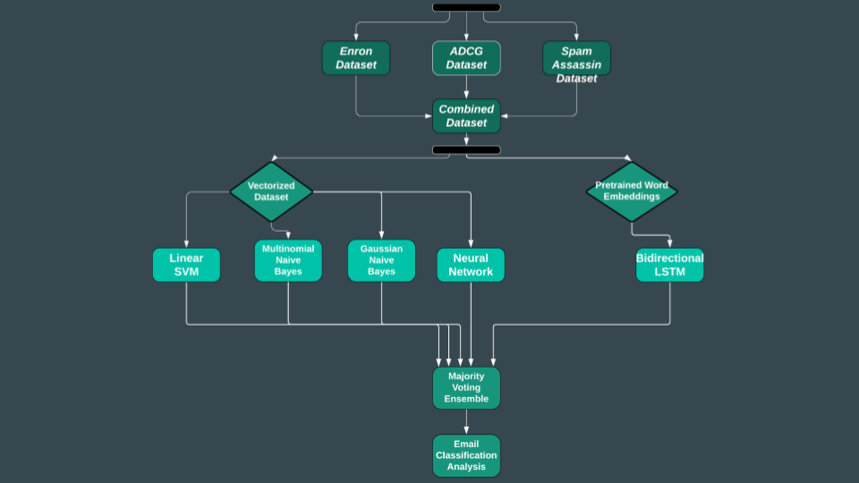

# 6220-spam-detection-project
Welcome to our spam detection ensemble repository! 

# Repository Structure

> -- analysis 
> -- code 
>&nbsp;&nbsp;&nbsp;&nbsp;&nbsp;&nbsp; -- models 
>&nbsp;&nbsp;&nbsp;&nbsp;&nbsp;&nbsp; -- preprocess 
>&nbsp;&nbsp;&nbsp;&nbsp;&nbsp;&nbsp; -- ensemble 
> -- data 

- `analysis`: contains all of our statistics and generated word clouds regarding ham/spam misclassification and model performance
- `code`: folder that houses the majority of our pipeline
  - `models`: Python notebooks containing each of the model types (i.e., BiLSTM, NN, and sklearn models)
  - `preprocess`: Python notebooks for processing the individual datasets and then combining the datasets into the `data/fully_combined.csv` file
  - `ensemble`: folder with `Ensemble.ipynb` and model classification results
    - `Ensemble.ipynb`: Python notebook that pools each of the models' individual results into a singular dataframe, then runs the majority voting process on these results
- `data`: folder containing `fully_combined.csv`
  - `fully_combined.csv`: CSV file of our combined dataset

# How to run through the full pipeline

  ## Architecture Diagram
  

  ## Data

  ### Preprocessing and combining

  ## Models

  ### sklearn Models: LinearSVC, MultinomialNB, GaussianNB
  These models all accept vectorized emails as input. They have a 60/40 train/test split, and the LinearSVC has the best performance out of the three. To reproduce the vectorized dataset and scikit-learn models, run through the `code/models/sklearn_models.ipynb` notebook. 
  #### Vectorization
  There are vectorization functions inside of the Python notebook that will run on the `data/fully_combined.csv` dataset. The vectorization process starts off by finding the 6,000 most common words within the `fully_combined.csv` dataset and then vectorizing the `fully_combined.csv` dataset based on this vocabulary. The vectorized dataset is then saved to `data/vectorized_most_common.csv`. 
  #### Results
  The classification results for each of the sklearn models is combined into a single CSV file and saved under `ensemble/sklearn_results.csv`.
  
  ---

  ### Neural Network
  Vectorization
  
  ---

  ### Bidirectional LSTM
  In order to run the Bidirectional LSTM notebook, ensure that the data_file filepath is set to the complete dataset. 
  Due to dataset size, this notebook is configured to run in google colab. There are cells in place to handle mounting the drive and accessing the relevant data file if it exists.

  #### Pretrained word embeddings:
  Execution of the notebook cells will download and unzip the pretrained Glove embedding. 
  Stepping through to the end will unpack the dataset and store in the local variables, run the training process, and output the classifications of the model as a csv. 
  This classification output is an input for the ensemble notebook.
  
  ---
